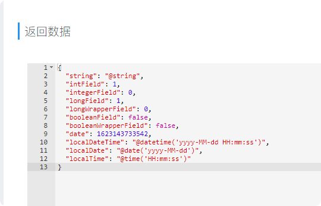
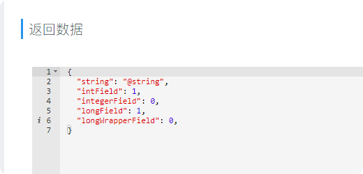

# Generate Api Plus
《Generate Api Plus》是在《Generate Api》基础上修改而来！！！
传送门：[api-generator github地址](https://github.com/Forgus/api-generator)
。增加多模块支持、泛型字段解析等功能

新增功能 Copy as cURL；灵感来自于Chrome浏览器的Copy as cURL功能

## 简介
《Generate Api Plus》是一款可以自动生成接口文档的IDEA插件。包括基于Spring注解的RESTful接口和用于定义dubbo api的普通接口。其中，RESTful接口将自动上传并托管在内网部署的YApi服务器上，而普通接口则以markdown文件的形式保存在指定目录。
所以，如果你想利用该插件的能力帮你生成REST接口文档，请先确保你已部署好自己的YApi服务端。
传送门：[如何部署YApi平台](https://hellosean1025.github.io/yapi/devops/index.html)

## 特性
- 基于javadoc解析，无代码入侵
- 支持字段过滤，自动忽略过滤字段的解析
- 自动识别类，生成markdown文档或上传到YApi
- 支持List、Set、Collection等数据结构，支持嵌套泛型解析
- 支持@NotNull、@ResponseBody等常用注解的解析，基于json5生成YApi文档

## 快速开始
### 安装插件
Preferences → Plugins → Marketplace → 搜索“Generate Api Plus” → 安装该插件 → 重启IDE

### 开始使用
#### 上传REST接口
选择一个Controller类，将光标定位到方法区（方法名或者方法注释）或Controller类上，点击鼠标右键，在弹出的菜单项里选择“Generate Api Plus”单击，文档瞬间已经自动生成并托管到YApi平台！
（PS：首次使用会弹框提示输入YApi部署的url和项目token，填写一次自动保存）

#### 生成dubbo接口文档
操作方式同上，插件会自动识别出这是一个普通接口，插件会将文档以markdown的形式输出，默认保存在当前项目的target目录下。（保存路径可更改，见下文介绍）

## 插件设置
自定义配置项： Preferences —> Other Settings —> Generate Api Plus Setting

配置项|含义|详细解释
---|---|---
Exclude Fields|过滤字段（多个字段以","分隔）|该配置项功能类似JSONField，用于过滤不想被解析的字段，多用于排除二方包里的干扰字段
Save Directory|markdown文档保存目录（绝对路径）|用于配置生成的markdown形式的接口文档的保存路径，默认保存在当前项目的target目录
Indent Style|二级字段缩进前缀|生成的markdown文档是类似于json schema的字段表格，涉及类型是对象的字段，展示上做缩进处理，默认缩进前缀是“└”
Overwrite exists docs|是否覆盖同名markdown文档|如果生成的markdown文件已存在，会弹框提示是否覆盖，勾选该选项，则直接覆盖不提示
Extract filename from doc comments|是否从javadoc抽取文件名|生成的markdown文件默认是方法名，勾选该选项，将从注释里抽取文件名
YApi server url|YApi部署服务器地址|内网部署的yapi平台的域名，如：http://yapi.xxx.com
Project token|项目token|接口对应的yapi项目的token
Default save category|默认保存分类|插件生成的yapi文档保存位置，默认api_generator
Classify API automatically|是否自动分类|勾选该选项后，生成文档时插件将从controller类注释里抽取模块名，并在yapi上自动创建对应分类保存接口
Ignore response|忽略返回数据|勾选该选项后，上传到YApi的接口没有返回数据
多模块项目配置|-|-
Is Multiple Module Project|是否是多模块项目|勾选该选项后，插件会根据包名查找对应的token
Is Use Default Token|是否使用默认token|Is Multiple Module Project选项被勾选后生效；勾选该选项后，插件根据包名没有找到对应的token时，使用默认token。未勾选该选项时，插件会弹出提示框

## 注释
配置项|含义|详细解释
---|---|---
@res_body_is_json_schema|返回数据是否为 json-schema|可选值true,false；默认值：false
@res_body_type|返回数据类型|枚举: json,raw 默认：json
@res_body|返回数据|覆盖插件自动生成的返回数据

值为ignore时，代表上传接口信息至YApi时忽略该字段。

### @res_body


```java
//基本数据类 BasicDataType
@Data
public class BasicDataType {

    private String string;
    private int intField;
    private Integer integerField;
    private long longField;
    private Long longWrapperField;
    private boolean booleanField;
    private Boolean booleanWrapperField;
    private Date date = new Date();
    private LocalDateTime localDateTime = LocalDateTime.now();
    private LocalDate localDate = LocalDate.now();
    private LocalTime localTime = LocalTime.now();

}
```

不使用@res_body时上传接口如下：
```java
@RestController
public class TestController {
    // 接口
    @PostMapping("/test2")
    public BasicDataType test2(){
        return null;
    }
}
```



使用@res_body时上传接口如下：
```java
@RestController
public class TestController {
    /**
     *
     * @return
     * @res_body {
     *   "string": "使用@res_body",
     *   "intField": 1,
     *   "integerField": 0,
     *   "longField": 1,
     *   "longWrapperField": 0,
     * }
     */
    @PostMapping("/test2")
    public BasicDataType test2(){
        return null;
    }
}
```



# Copy as cUrl
《Copy as cUrl》可以一键生成在cmd、bash上运行的curl命令，或生成[fetch](https://developer.mozilla.org/zh-CN/docs/Web/API/Fetch_API/Using_Fetch)方法帮助开发者快速调试接口。该功能是受Chrome的Copy as cUrl功能启发。生成的curl命令可以导入到postman中

## 快速开始
选择一个类，点击鼠标右键，在弹出的菜单项里选择“Copy as cURL - Generate Project Modules”单击，插件会自动扫描项目中对应的模块和模块端口。
光标定位到方法名，点击鼠标右键，在弹出的菜单项里选择“Copy as cURL - Copy as cURL (bash)”单击，打开postman； 首页左上角点击import->raw text;在输入框粘贴；点击continue->import。


## 插件设置

### Base Api
插件默认或本机ip加端口作为baseApi。不符合预期时，可以自己指定 示例：http://www.aaa.com/api


### Canonical Class Name
类的引用,用于指定某个类中的字段在生成curl时是包含还是不包含
包名+类名 (选中类名，右键点击Copy Reference) 示例：java.lang.String；
有泛型的类不写泛型类型，如List<T> java.util.List<
有多个类时用;分隔

### Include Fields
生成的curl命令中包含的字段名,字段之间使用,分隔；不同Canonical Class Name的字段使用;分隔
示例：size,current 或 size,current;name,age


### Exclude Fields
生成的curl命令中不包含的字段名,字段之间使用,分隔；不同Canonical Class Name的字段使用;分隔
示例：size,current 或 size,current;name,age


### Array Format
content-type为application/x-www-form-urlencoded时，数组参数的格式

[规则如下](https://github.com/ljharb/qs)：
```$xslt
qs.stringify({ a: ['b', 'c'] }, { arrayFormat: 'indices' })
// 'a[0]=b&a[1]=c'
qs.stringify({ a: ['b', 'c'] }, { arrayFormat: 'brackets' })
// 'a[]=b&a[]=c'
qs.stringify({ a: ['b', 'c'] }, { arrayFormat: 'repeat' })
// 'a=b&a=c'
qs.stringify({ a: ['b', 'c'] }, { arrayFormat: 'comma' })
// 'a=b,c
```

### Exclude Children Field
是否包含Canonical Class Name中指定的类的字段的子字段
如：
```$xslt
public class A{
    private String aName;
}
public class B{
    private String bName;
    private A a;
}
```
Canonical Class Name值包含com.xxx.B，Exclude Children Field值为true时，curl命令不会包含A类的字段aName；为false时，包含A类的字段aName


## Copy as fetch
将Spring MVC接口复制成[fetch](https://developer.mozilla.org/zh-CN/docs/Web/API/Fetch_API/Using_Fetch)方法。配置参数各个含义可查看文档：  [fetch()](https://developer.mozilla.org/zh-CN/docs/Web/API/WindowOrWorkerGlobalScope/fetch)


