# 配置
## YApi 项目设置
File -> Settings... -> Tools -> Api Generator Plus -> YApi Setting  

### YApi server url
YApi 网站域名，示例：http://yapi.smart-xwork.cn/

### Project url
YApi 项目 `token`
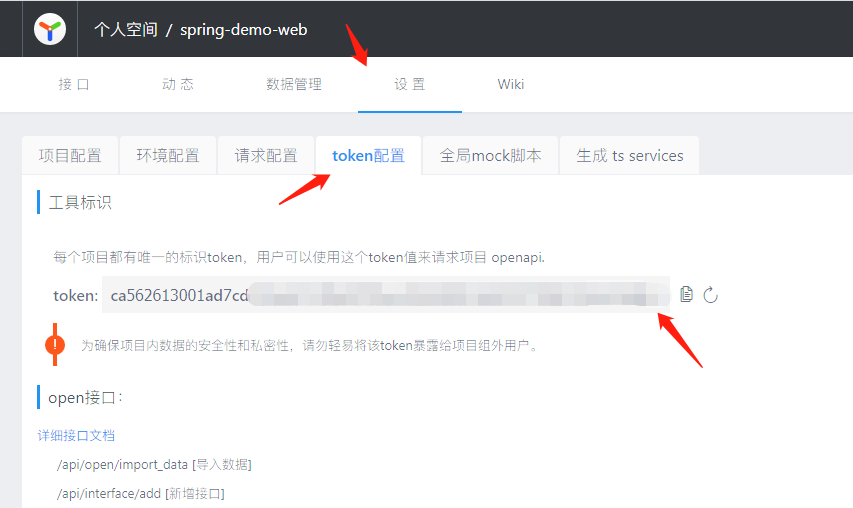

### Default save category

* 默认值 `api_generator_plus`  

默认分类名称；关闭配置 `Classify API automatically` 或 类注释第一行不存在时，上传接口时会自动上传到此分类下。
如 Java 代码如下：
```java
/**
 * @author lmx 2021/11/15 12:53
 */
@RestController
@RequestMapping("/guide")
public class GuideController {

    @GetMapping("/guide1")
    public ResultVo guide1(String name, Integer id){
        return ResultVoBuilder.success();
    }

}
```
生成的接口如下：

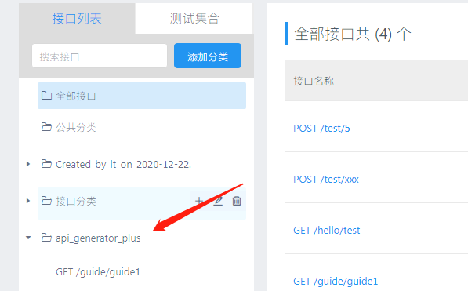

### Tag
设置 `tag` 名称
默认未设置 `tag` 时上传接口如下：
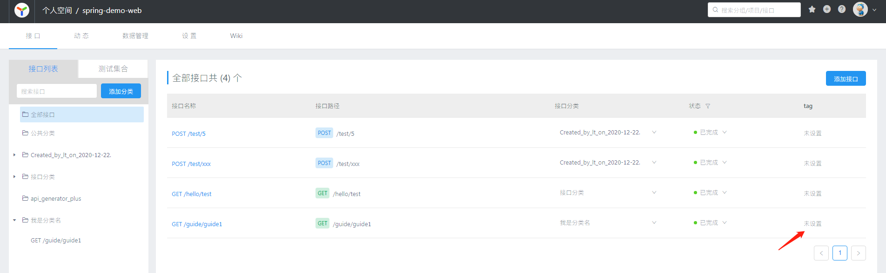

设置 `tag` 为 `v1.0` 时上传接口如下：
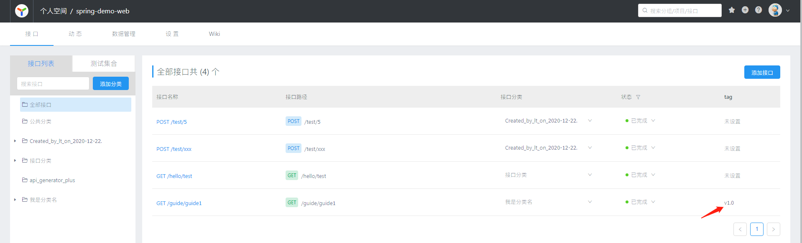

### Classify API automatically
* 默认值 `true`  

上传接口时是否自动分类。开启时插件会自动读取 controller 类注释的第一行作为分类名；关闭时插件使用配置 `Default save category` 作为分类名  
如 Java 代码如下：
```java
/**
 * 我是分类名
 * @author lmx 2021/11/15 12:53
 */
@RestController
@RequestMapping("/guide")
public class GuideController {

    @GetMapping("/guide1")
    public ResultVo guide1(String name, Integer id){
        return ResultVoBuilder.success();
    }

}
```
生成的接口如下：

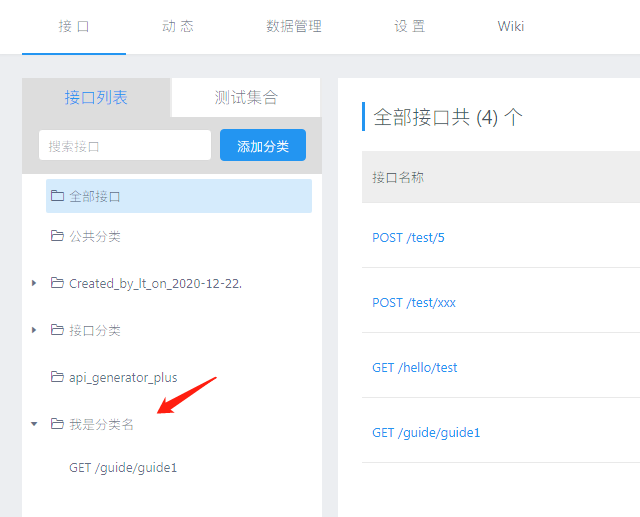

### Ignore response
* 默认值 `false`  

上传接口至 YApi 时是否忽略返回数据。

值为false时
```
@RestController
@RequestMapping("/guide")
public class GuideController {

    @GetMapping("/guide1")
    public String guide1(String name, Integer id){
        return "";
    }

}
```
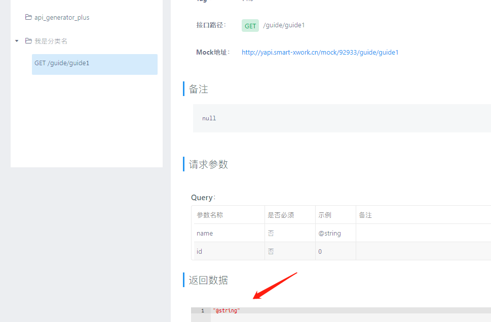

值为 true 时，分两种情况，当新建接口时返回数据为空。当更新接口时返回数据不会被更改。可与注释标签 `@res_body` 配合使用

1. 新增接口，返回数据为空

```
@RestController
@RequestMapping("/guide")
public class GuideController {

    @GetMapping("/guide2")
    public String guide1(String name, Integer id){
        return "";
    }

}
```
YApi 接口返回数据：

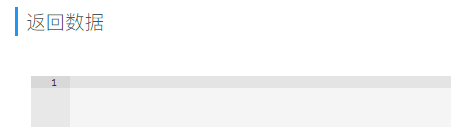  

2. 更新接口，返回数据不会被修改

```java {6-7}
@RestController
@RequestMapping("/guide")
public class GuideController {

    @GetMapping("/guide1")
    public List<String> guide1(String name, Integer id){
        return null;
    }

}
```
YApi 接口返回数据：

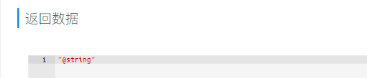

### Api Done
* 默认值 `false`  

接口状态。未选中为 `未完成`, 选中为 `已完成`
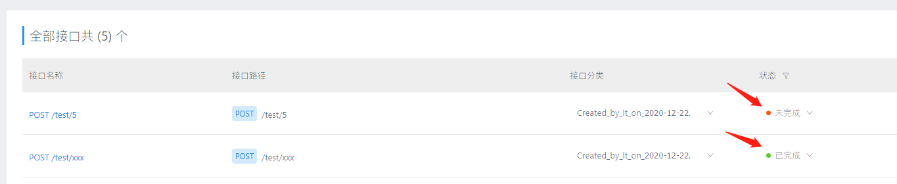

## Module config
开发过程中可能会遇到多模块项目，不同模块中的接口可能想上传到不同的 YApi 项目，这时候就可以使用多模块配置

### Is Mulitiple Module Project
* 默认值 `false`  

是否是多模块项目，选中后使用多模块项目配置

### Use default token
* 默认值 `false`  

是否使用默认项目 Token，开启后所有的模块级别的项目 Token 失效

### Match with module name
* 默认值 `false`  

是否使用模块名匹配模块级别配置，默认 `false` 代表使用包名匹配，`true` 代表使用模块名匹配。

## 模块级别配置

### Name
模块配置名称，使用自动扫描时等于模块名称
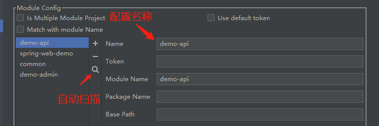

### Token
YApi 项目 Token

### Module Name
模块名称

### Package Name
包名

### Base Path
通用基本路径，如果填入 `/admin`, YApi 接口路径会自动加上前缀 `/admin`

比如在 application.properties 中配置了 `server.servlet.context-path=/admin`，那么 Base Path 就应该填入 /admin。
```
server.servlet.context-path=/admin
```
```java
/**
 * 我是分类名
 * @author lmx 2021/11/15 12:53
 */
@RestController
@RequestMapping("/guide")
public class GuideController {

    @GetMapping("/guide1")
    public String guide1(String name, Integer id){
        return "";
    }

}
```
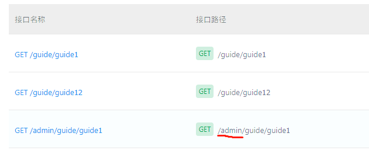


## Api Setting
File -> Settings... -> Tools -> Api Generator Plus -> Api Setting  

### Exclude Fields
* 默认值 `serialVersionUID`  
过滤字段（多个字段以","分隔）。该配置项功能类似JSONField，用于过滤不想被解析的字段，多用于排除二方包里的干扰字段

### Exclude annotations
* 默认值 `@CurrentId,@CurrentUserId;@CurrentMerchantId,`  
过滤被注解的字段（多个注解以","分隔）。用于过滤不想被解析的`被注解字段`

```java
@RestController
@RequestMapping("/guide")
public class GuideController {

    @GetMapping("/guide1")
    public String guide1(String name, @CurrentId Integer id){
        return "";
    }

}
```
上传接口如下：  

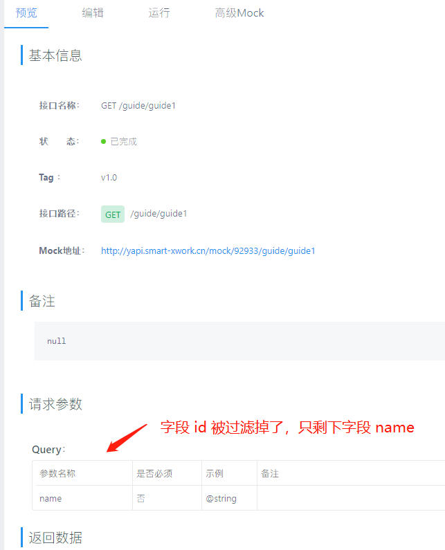


### Save Directory

markdown文档保存目录（绝对路径）；用于配置生成的markdown形式的接口文档的保存路径，默认保存在当前项目的target目录

### Indent Style

二级字段缩进前缀；生成的markdown文档是类似于json schema的字段表格，涉及类型是对象的字段，展示上做缩进处理，默认缩进前缀是“└”

### Overwrite exists docs

是否覆盖同名markdown文档；如果生成的markdown文件已存在，会弹框提示是否覆盖，勾选该选项，则直接覆盖不提示

### Extract filename from doc comments

是否从javadoc抽取文件名；生成的markdown文件默认是方法名，勾选该选项，将从注释里抽取文件名


## Filter Class Field
过滤类中的字段。使用 `Canonical Class Name` 指定需要过滤的类，使用 `Include Fields` 指定需要包含的字段，使用 `Exclude Fields` 指定需要排除的字段。都指定时，`Include Fields` 优先级高于 `Exclude Fields`。

### Canonical Class Name
类的引用信息,用于指定需要过滤的类。多个类引用使用 `;` 分隔。有泛型的类不写泛型类型，如：`List<T>` 只输入 `java.util.List<`  就可以了

::: tip
如何获取类的引用？ IDEA 选中类名，右键点击 Copy Reference，复制出的信息就是。 示例：`java.lang.String`
:::


### Include Fields
不需要过滤的的字段，  
同一个类中的多个字段使用 `,` 分隔，示例：`size,current` ；  
不同类字段使用 `;` 分隔，示例：`size,current;name,age` 。  

与 `Canonical Class Name` 的对应关系是行对行，如 `Canonical Class Name` 第一行为 `java.util.List`，`Include Fields` 第一行为 `name,id`；表示只解析 `java.util.List` 类中的 `name` 和 `id` 字段，其他字段忽略掉。

::: tip
`Include Fields` 优先级高于 `Exclude Fields`
:::


### Exclude Fields

不需要过滤的的字段，  
同一个类中的多个字段使用 `,` 分隔，示例：`size,current` ；  
不同类字段使用 `;` 分隔，示例：`size,current;name,age` 。 

与 `Canonical Class Name` 的对应关系是行对行，如 `Canonical Class Name` 第一行为 `java.util.List`，`Include Fields` 第一行为 `name,id`；表示只解析 `java.util.List` 类中的 `name` 和 `id` 字段，其他字段忽略掉。


## Copy as cURL
File -> Settings... -> Tools -> Copy as cURl -> Copy as cURl  

Chrome 浏览器 DevTool 中有一个很好用的功能叫 `copy as cURL`，这里实现的功能和 Chrome 是一样的。生成的 curl 命令可导入到 Postman 中

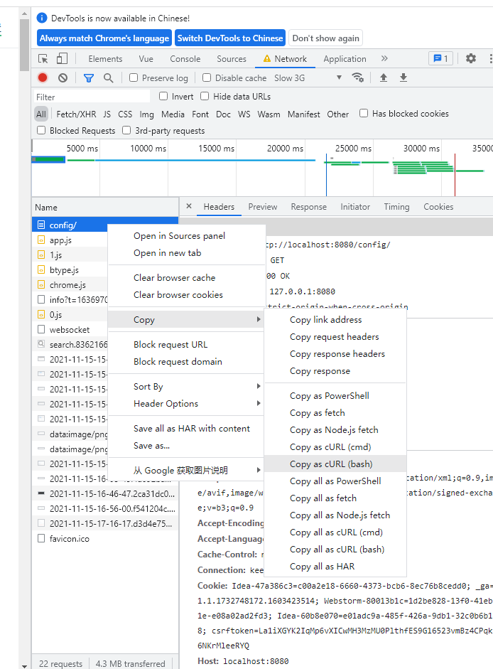

复制结果为：
```curl
curl 'http://localhost:8080/config/' \
  -H 'Connection: keep-alive' \
  -H 'Cache-Control: max-age=0' \
  -H 'sec-ch-ua: "Google Chrome";v="95", "Chromium";v="95", ";Not A Brand";v="99"' \
  -H 'sec-ch-ua-mobile: ?0' \
  -H 'sec-ch-ua-platform: "Windows"' \
  -H 'Upgrade-Insecure-Requests: 1' \
  -H 'User-Agent: Mozilla/5.0 (Windows NT 10.0; Win64; x64) AppleWebKit/537.36 (KHTML, like Gecko) Chrome/95.0.4638.54 Safari/537.36' \
  -H 'Accept: text/html,application/xhtml+xml,application/xml;q=0.9,image/avif,image/webp,image/apng,*/*;q=0.8,application/signed-exchange;v=b3;q=0.9' \
  -H 'Sec-Fetch-Site: same-origin' \
  -H 'Sec-Fetch-Mode: navigate' \
  -H 'Sec-Fetch-User: ?1' \
  -H 'Sec-Fetch-Dest: document' \
  -H 'Accept-Language: zh-CN,zh;q=0.9' \
  -H 'Cookie: Idea-47a386c3=c00a2e18-6660-4373-bcb6-8ec76b8cedd0; _ga=GA1.1.1732748172.1603423514; Webstorm-80013b1c=1d2be828-13f0-41eb-b01e-e08a02ad2fd3; Idea-60b8e070=e01adc9a-485f-426a-9db1-32c0b6b13198; csrftoken=La1iXGYK2IqMp6vXICwMH3MzMU0PlthfES9G16523vmBz4CPqkKpo6NKrMleeRYQ' \
  -H 'If-None-Match: W/"11f-Zn+0AjH/vxli4WLj1EMYz+sNabc"' \
  --compressed
```

### Base Api 
配置 curl 请求基本路径，默认为 http://本地ip:端口

不填为默认配置，插件生成的 curl 命令
```
curl 'http://172.16.3.8:8882/admin/guide/guide1?name=@string&id=0' -X GET 
```

比如输入：http://h5.buyi.cn

插件生成 curl 命令并复制到剪切板，内容如下，请求路径被换成了 http://h5.buyi.cn
```
curl 'http://h5.buyi.cn/admin/guide/guide1?name=@string&id=0' -X GET 
```


### Canonical Class Name
类的引用信息,用于指定需要过滤的类。多个类引用使用 `;` 分隔。有泛型的类不写泛型类型，如：`List<T>` 只输入 `java.util.List<`  就可以了

::: tip
如何获取类的引用？ IDEA 选中类名，右键点击 Copy Reference，复制出的信息就是。 示例：`java.lang.String`
:::


### Include Fields
不需要过滤的的字段，  
同一个类中的多个字段使用 `,` 分隔，示例：`size,current` ；  
不同类字段使用 `;` 分隔，示例：`size,current;name,age` 。  

与 `Canonical Class Name` 的对应关系是行对行，如 `Canonical Class Name` 第一行为 `java.util.List`，`Include Fields` 第一行为 `name,id`；表示只解析 `java.util.List` 类中的 `name` 和 `id` 字段，其他字段忽略掉。

::: tip
`Include Fields` 优先级高于 `Exclude Fields`
:::


### Exclude Fields

不需要过滤的的字段，  
同一个类中的多个字段使用 `,` 分隔，示例：`size,current` ；  
不同类字段使用 `;` 分隔，示例：`size,current;name,age` 。 

与 `Canonical Class Name` 的对应关系是行对行，如 `Canonical Class Name` 第一行为 `java.util.List`，`Include Fields` 第一行为 `name,id`；表示只解析 `java.util.List` 类中的 `name` 和 `id` 字段，其他字段忽略掉。


### Array Format

content-type为application/x-www-form-urlencoded时，数组参数的格式

[规则如下](https://github.com/ljharb/qs)：
```$xslt
qs.stringify({ a: ['b', 'c'] }, { arrayFormat: 'indices' })
// 'a[0]=b&a[1]=c'
qs.stringify({ a: ['b', 'c'] }, { arrayFormat: 'brackets' })
// 'a[]=b&a[]=c'
qs.stringify({ a: ['b', 'c'] }, { arrayFormat: 'repeat' })
// 'a=b&a=c'
qs.stringify({ a: ['b', 'c'] }, { arrayFormat: 'comma' })
// 'a=b,c
```

### Exclude Children Field
* 默认值 `true`

是否排除 `Canonical Class Name` 中声明的类过滤后字段的子字段。

示例：
```java
public class A {
    private String aName;
    private B b;
}

public class B {
    private String bName;
}
```
```
# Canonical Class Name 
com.example.A;

# Include Fields
aName,b;

# 默认选中 Exclude Children Field ，此时插件解析时会忽略类 B 中的字段 bName
# 取消选中 Exclude Children Field ，此时插件解析时“不会”忽略类 B 中的字段 bName
```

## Module info
在多模块项目中为模块单独配置，点击 [Find Module Info]() 可以自动扫描项目包含模块信息

### Module name
模块名称，不建议修改。

### Port
模块端口，自定义 [Base Api](#base-api) 未配置时的端口

### Context Path
模块基本路径，默认为 `application.properties` 文件中配置：

```properties
server.servlet.context-path=/admin
```

### Headers
自定义请求 header

示例：
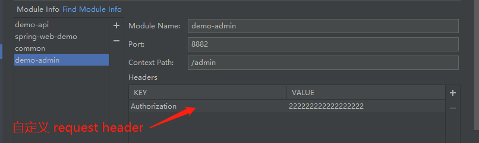

@RequestMapping 方法上 单击右键 -> Copy as -> Copy as cURL(Bash)，结果如下：

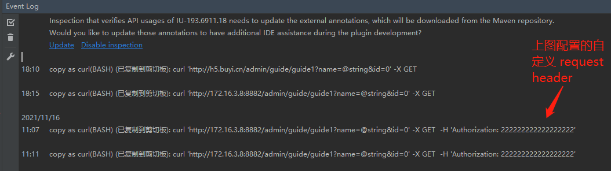

```curl
curl 'http://172.16.3.8:8882/admin/guide/guide1?name=@string&id=0' -X GET  -H 'Authorization: 222222222222222222'
```

