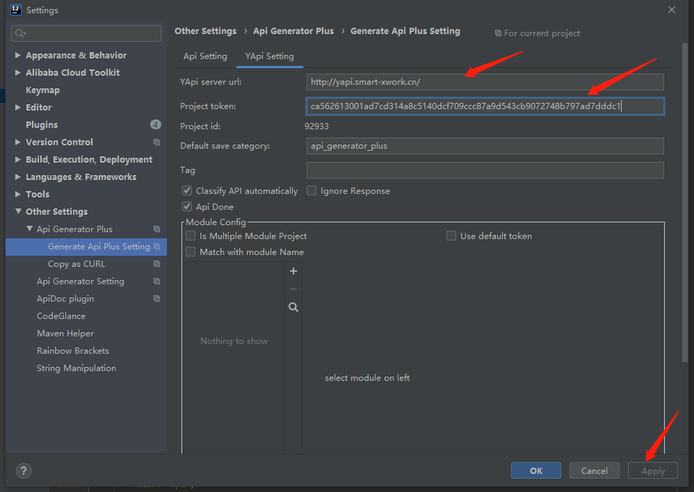
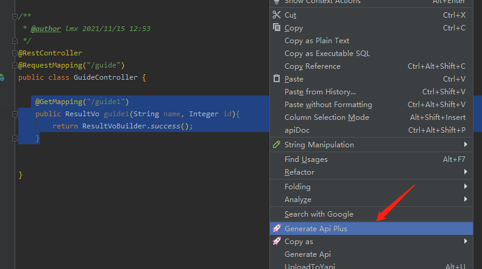
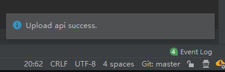
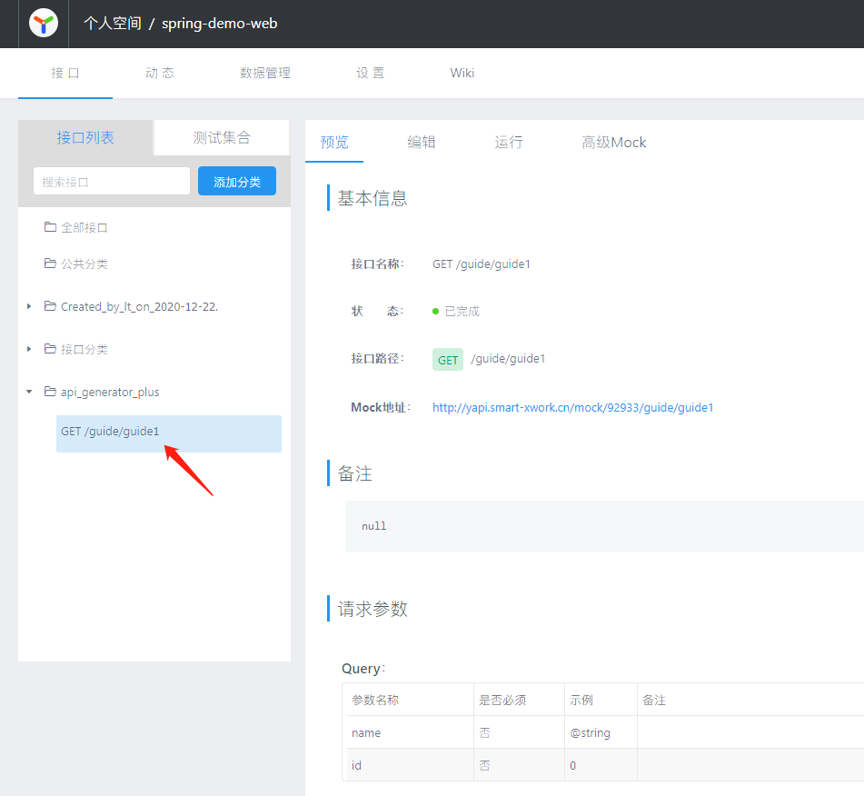

# 快速开始

以下教程使用 IDEA 2019.3.4 版本演示

1. 安装插件并重启 IDEA  
打开 IDEA 中的插件管理，左上角 File -> Settings... -> Plugins -> Marketplace。输入 Api Generator Plus，找到插件点击  install，安装成功后点击 Restart IDE

2. 配置 YApi 域名和项目 Token  
打开插件配置，File -> Settings... -> Tools -> Api Generator Plus -> Generator Api Plus -> YApi Setting。  
输入YApi server url：http://yapi.smart-xwork.cn/    
输入Project Token：ca562613001ad7cd314a8c5140dcf709ccc87a9d543cb9072748b797ad7dddc1  
点击 Apply，

::: danger
如果提示错误，请检查 url 和 token 是否输入错误
:::

3. 上传接口  
打开 Spring MVC 或 Spring Boot 项目，打开 任意一个 controller 类，鼠标移动到方法上单击右键，选择 Generate Api Plus，插件就会自动生成接口信息并上传至YApi，

成功后，右下角会提示 Upload api success.   

  

打开 YApi 中的项目，可以看到接口已上传成功

  

